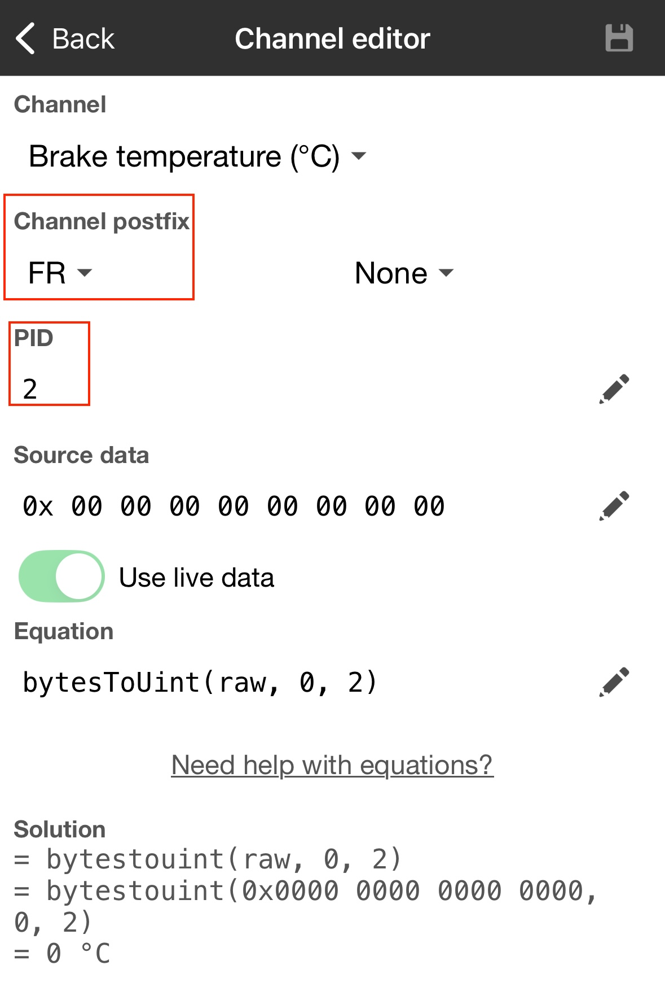

_You may [buy me a tea](https://buymeacoffee.com/yugene.ka) if you want to thank me. Also, [I can make the device on demand](mailto:yugene.ka@gmail.com)._

# ThermoBrakes

This project describes how to create a brake pad temperature monitoring device suitable for use on a race track or in daily applications.

It can show the temperature on a small LCD and/or send it to RaceChrono.

The total price for the parts is about 50$/Euro

Temperature on the display (click on pic to see the video)

Temperature in RaceChrono (click on pic to see the video)

And how the data looks when imported from RaceChrono

## Bill of materials
* ESP32 - the MCU with BLE to manage everything. I used a devkit 30-pin with USB-C, but you can adjust to any kind of ESP32, just reshape the holes and the pins soldering and mapping in the code.
* MAX6675 - the module that reads the temperature, one per thermocouple and pad.
* LCD1602 - small LCD to display the temperature.
* Thermocouples K-type - thermocouples placed into flexible stainless steel wires, which are easy to bend, but they keep their shape inside the pads. I used 1mmX100mm from Aliexpress, see the picture below. But you can use anything more suitable in your case for your pads/callipers setup. There are also special brake pads thermocouples like [this](https://thesensorconnection.com/products/brake-temperature-sensors).
* a bit of 24awg wires.
* 16 or so 2.5x4mm screws to keep everything in place.

## Instructions
_The example below is made for 2 temperature modules to measure front brakes; you may add the other two for rear brakes, following the same logic._

1. Print the bottom and the top of the box from the 3d models folder. Use anything up to your taste, or PETG if you don't know what to choose as a material for printing.

2. Assemble the components as shown below.

3. Solder the wires to the pins as shown below.
Use the next link to see which pins are connected. Just click on the pins to see the pin numbers. https://app.cirkitdesigner.com/project/6f37f9e0-6bc4-4790-a0e1-f7498efd84e8

4. Then download this repo, build and upload it with Visual Studio Code with the PlatformIO plugin.

5. The box is ready, now the thermocouples.

For that, you need to figure out how to put them in your specific case.

In my case, I simply drilled the pad in the place where the friction material is popping out from the back side.

This place is just next to the calliper piston.

I drilled the pad through and first pushed the probe right to the braking disk and then pulled it slightly back to avoid constant contact with the disk.

Move it back and forth with your fingers to feel where it is positioned and adjust it correctly.

Then the thermocouple wires are going under the hood through the firewall to the box placed on the dashboard or wherever you want, and powered over a USB cable.

6. The last is the RaceChrono configuration.

When the box is turned on, open RaceChrono, go to Settings -> Other devices -> Add RaceChrono DIY -> BLE and find your box, then connect it.

Then you should go to your vehicle profile and add CAN-Bus channels as below. PID numbers are connected to the PacketID and the MAX6675 module numbers in the code.

## Validation

During the testing, I found that the wrong placement of the probe may result in incorrect temperature readings.

If you let the probe constantly touch the braking disc, then you will see the temperature growing when you are not braking.

When everything is perfect, you should see no change or decrease in the brake temperature while cruising and not touching the brakes.

When you brake, the temperature should increase and ideally increase equally on both sides if you are driving and braking straight.

And the temperature on both sides should be very close, within 20 °C.

Each deviation from it would mean the thermocouples may be installed incorrectly, OR there is something wrong with your brakes, like pads are not moving freely in the callipers.

Later on, the numbers may be different from different callipers because of heavier right or left turns or many other conditions.

The LCD blinking threshold may be set in the code, depending on your pad's temperature threshold.
